# Valid Flowchart Diagrams

This file contains all valid flowchart test fixtures rendered with both Mermaid and our Maid renderer.

> **Note**: This file is auto-generated by `scripts/generate-previews.js`. Do not edit manually.

## Renderer Comparison

| Renderer | Description |
|----------|-------------|
| **Mermaid** | Official Mermaid.js renderer (GitHub/mermaid-cli) |
| **Maid** | Our experimental renderer (only for supported types) |

## Table of Contents

1. [backticks in label](#1-backticks-in-label)
2. [br in label](#2-br-in-label)
3. [chained connections](#3-chained-connections)
4. [class style unknown targets](#4-class-style-unknown-targets)
5. [comments](#5-comments)
6. [complex shapes](#6-complex-shapes)
7. [complex text with keywords](#7-complex-text-with-keywords)
8. [custom auth subgraph](#8-custom-auth-subgraph)
9. [duplicate ids redefine](#9-duplicate-ids-redefine)
10. [duplicate subgraph](#10-duplicate-subgraph)
11. [edge attr id unknown](#11-edge-attr-id-unknown)
12. [edge attrs animate](#12-edge-attrs-animate)
13. [edge ids and animation](#13-edge-ids-and-animation)
14. [edge label brackets encoded quotes](#14-edge-label-brackets-encoded-quotes)
15. [edge label quoted pipe br backticks](#15-edge-label-quoted-pipe-br-backticks)
16. [empty diagram](#16-empty-diagram)
17. [frontmatter theme](#17-frontmatter-theme)
18. [html in labels](#18-html-in-labels)
19. [interactions linkstyle multi](#19-interactions-linkstyle-multi)
20. [keywords in labels](#20-keywords-in-labels)
21. [link styles](#21-link-styles)
22. [long text](#22-long-text)
23. [mismatched quotes](#23-mismatched-quotes)
24. [multidirectional arrows](#24-multidirectional-arrows)
25. [nested subgraphs lr](#25-nested-subgraphs-lr)
26. [nested subgraphs](#26-nested-subgraphs)
27. [node ids special](#27-node-ids-special)
28. [node to subgraph](#28-node-to-subgraph)
29. [only nodes](#29-only-nodes)
30. [quotes single inside double](#30-quotes-single-inside-double)
31. [simple flow](#31-simple-flow)
32. [special arrows](#32-special-arrows)
33. [special chars](#33-special-chars)
34. [styling classes](#34-styling-classes)
35. [subgraph nested direction](#35-subgraph-nested-direction)
36. [subgraph quoted title](#36-subgraph-quoted-title)
37. [subgraph to node](#37-subgraph-to-node)
38. [subgraph to subgraph lr](#38-subgraph-to-subgraph-lr)
39. [subgraph to subgraph](#39-subgraph-to-subgraph)
40. [subgraphs](#40-subgraphs)
41. [typed shapes bad units](#41-typed-shapes-bad-units)
42. [typed shapes basic](#42-typed-shapes-basic)
43. [undefined node](#43-undefined-node)
44. [unicode text](#44-unicode-text)
45. [with text](#45-with-text)

---

## 1. Backticks In Label

📄 **Source**: [`backticks-in-label.mmd`](./valid/backticks-in-label.mmd)

### Rendered Output

<table>
<tr>
<th width="50%">Mermaid (Official)</th>
<th width="50%">Maid (Experimental)</th>
</tr>
<tr>
<td>

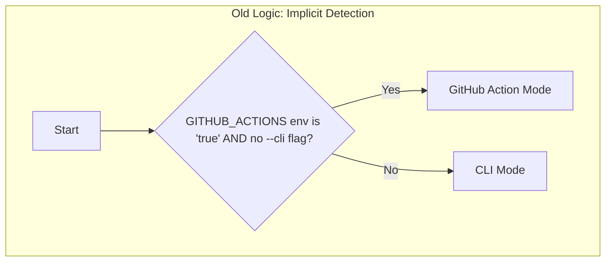

</td>
<td>

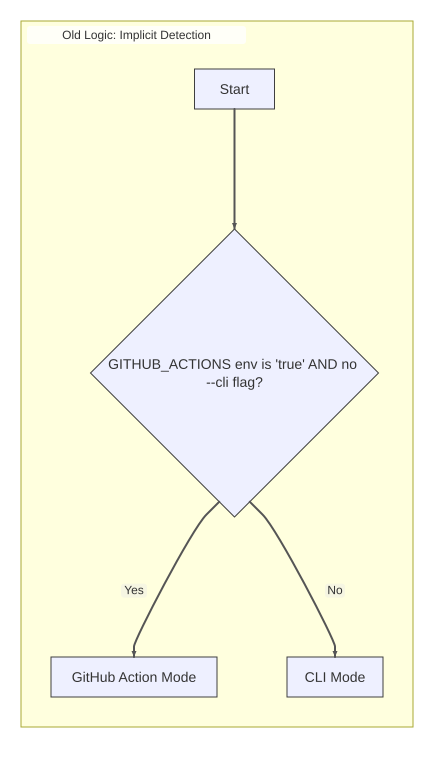

</td>
</tr>
</table>

<details>
<summary>View source code</summary>

```
graph TD
    subgraph "Old Logic: Implicit Detection"
        A[Start] --> B{"GITHUB_ACTIONS env is 'true' AND no --cli flag?"};
        B -- Yes --> C[GitHub Action Mode];
        B -- No --> D[CLI Mode];
    end


```
</details>

---

## 2. Br In Label

📄 **Source**: [`br-in-label.mmd`](./valid/br-in-label.mmd)

### Rendered Output

<table>
<tr>
<th width="50%">Mermaid (Official)</th>
<th width="50%">Maid (Experimental)</th>
</tr>
<tr>
<td>

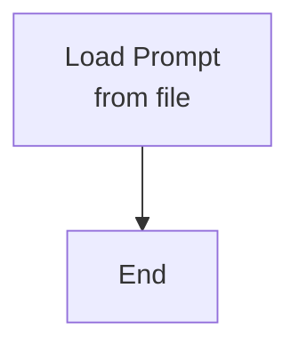

</td>
<td>

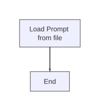

</td>
</tr>
</table>

<details>
<summary>View source code</summary>

```
flowchart TD
    A[Load Prompt<br/>from file] --> B[End]


```
</details>

---

## 3. Chained Connections

📄 **Source**: [`chained-connections.mmd`](./valid/chained-connections.mmd)

### Rendered Output

<table>
<tr>
<th width="50%">Mermaid (Official)</th>
<th width="50%">Maid (Experimental)</th>
</tr>
<tr>
<td>

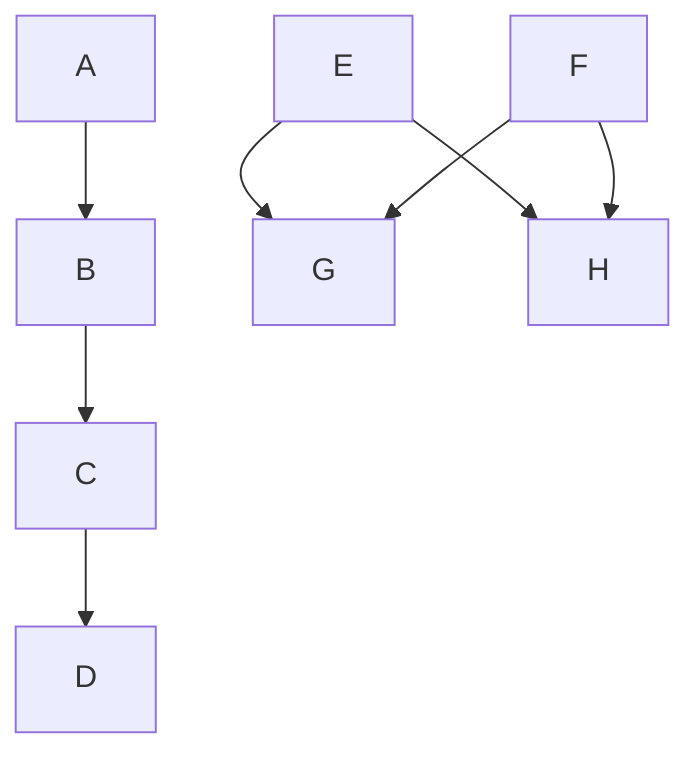

</td>
<td>

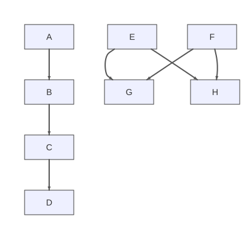

</td>
</tr>
</table>

<details>
<summary>View source code</summary>

```
flowchart TD
    A --> B --> C --> D
    E & F --> G & H
```
</details>

---

## 4. Class Style Unknown Targets

📄 **Source**: [`class-style-unknown-targets.mmd`](./valid/class-style-unknown-targets.mmd)

### Rendered Output

<table>
<tr>
<th width="50%">Mermaid (Official)</th>
<th width="50%">Maid (Experimental)</th>
</tr>
<tr>
<td>

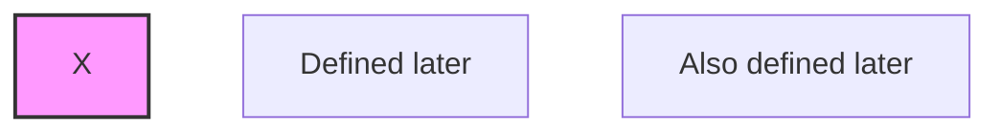

</td>
<td>

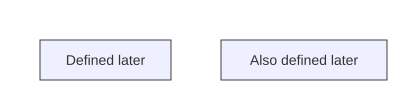

</td>
</tr>
</table>

<details>
<summary>View source code</summary>

```
flowchart TD
  %% Node defined after class/style — should be allowed; unknown id should warn
  class A,B highlight
  style X fill:#f9f,stroke:#333,stroke-width:2px
  A[Defined later]
  B[Also defined later]


```
</details>

---

## 5. Comments

📄 **Source**: [`comments.mmd`](./valid/comments.mmd)

### Rendered Output

<table>
<tr>
<th width="50%">Mermaid (Official)</th>
<th width="50%">Maid (Experimental)</th>
</tr>
<tr>
<td>

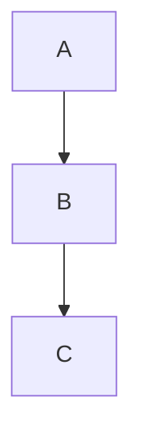

</td>
<td>

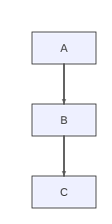

</td>
</tr>
</table>

<details>
<summary>View source code</summary>

```
flowchart TD
    %% This is a comment
    A --> B
    %% Another comment
    B --> C
```
</details>

---

## 6. Complex Shapes

📄 **Source**: [`complex-shapes.mmd`](./valid/complex-shapes.mmd)

### Rendered Output

<table>
<tr>
<th width="50%">Mermaid (Official)</th>
<th width="50%">Maid (Experimental)</th>
</tr>
<tr>
<td>

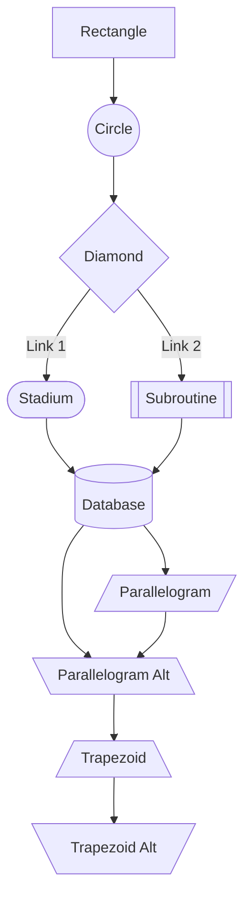

</td>
<td>

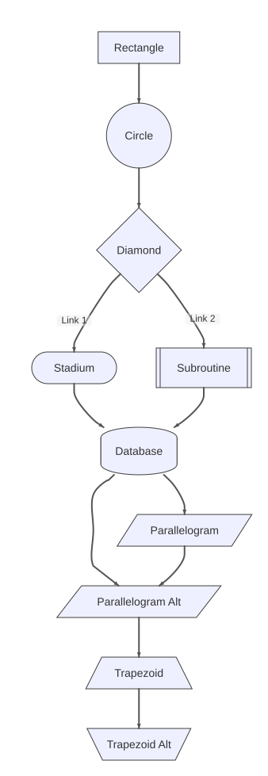

</td>
</tr>
</table>

<details>
<summary>View source code</summary>

```
flowchart TB
    A[Rectangle] --> B((Circle))
    B --> C{Diamond}
    C -->|Link 1| D([Stadium])
    C -->|Link 2| E[[Subroutine]]
    D --> F[(Database)]
    E --> F
    F --> H{{Hexagon}}
    F --> G[/Parallelogram/]
    G --> H[\Parallelogram Alt\]
    H --> I[/Trapezoid\]
    I --> J[\Trapezoid Alt/]

```
</details>

---

## 7. Complex Text With Keywords

📄 **Source**: [`complex-text-with-keywords.mmd`](./valid/complex-text-with-keywords.mmd)

### Rendered Output

<table>
<tr>
<th width="50%">Mermaid (Official)</th>
<th width="50%">Maid (Experimental)</th>
</tr>
<tr>
<td>

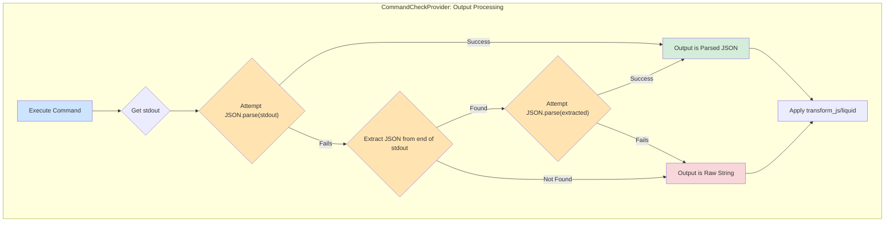

</td>
<td>

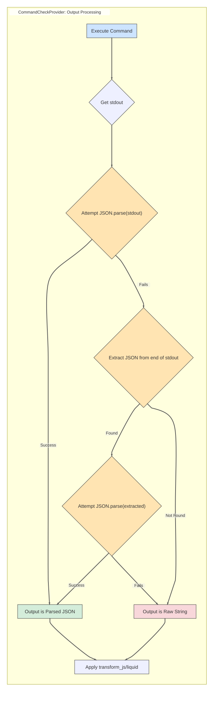

</td>
</tr>
</table>

<details>
<summary>View source code</summary>

```
flowchart TD
    subgraph "CommandCheckProvider: Output Processing"
        A[Execute Command] --> B{Get stdout};
        B --> C{"Attempt JSON.parse(stdout)"};
        C -- Success --> E[Output is Parsed JSON];
        C -- Fails --> D{"Extract JSON from end of stdout"};
        D -- Found --> F{"Attempt JSON.parse(extracted)"};
        D -- Not Found --> G[Output is Raw String];
        F -- Success --> E;
        F -- Fails --> G;
        E --> H["Apply transform_js/liquid"];
        G --> H;
    end

    style A fill:#cde4ff
    style C fill:#ffe4b2
    style D fill:#ffe4b2
    style F fill:#ffe4b2
    style E fill:#d4edda
    style G fill:#f8d7da

```
</details>

---

## 8. Custom Auth Subgraph

📄 **Source**: [`custom-auth-subgraph.mmd`](./valid/custom-auth-subgraph.mmd)

### Rendered Output

<table>
<tr>
<th width="50%">Mermaid (Official)</th>
<th width="50%">Maid (Experimental)</th>
</tr>
<tr>
<td>

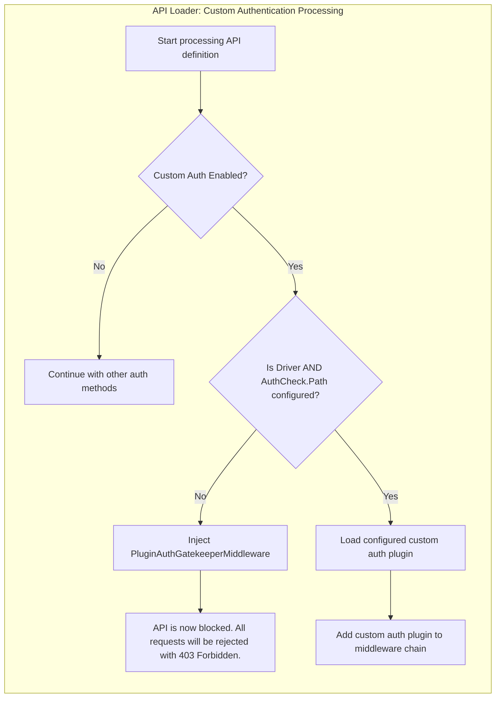

</td>
<td>

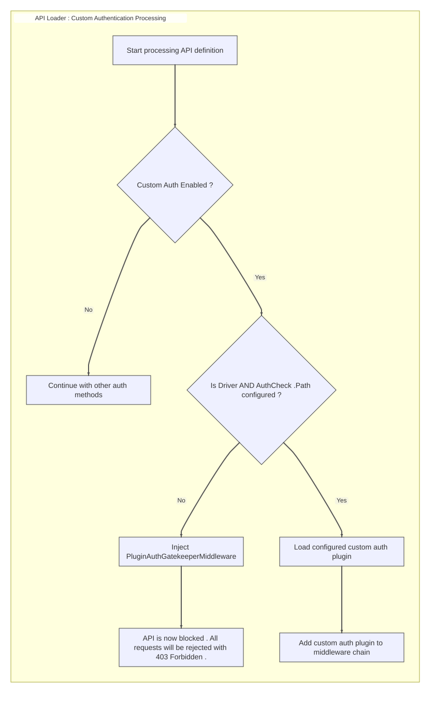

</td>
</tr>
</table>

<details>
<summary>View source code</summary>

```
flowchart TD
    subgraph API_Loader_Custom_Authentication_Processing[API Loader: Custom Authentication Processing]
        direction TB
        A[Start processing API definition] --> B{Custom Auth Enabled?}
        B -- No --> C[Continue with other auth methods]
        B -- Yes --> D{Is Driver AND AuthCheck.Path configured?}
        D -- No --> E[Inject PluginAuthGatekeeperMiddleware]
        E --> F[API is now blocked. All requests will be rejected with 403 Forbidden.]
        D -- Yes --> G[Load configured custom auth plugin]
        G --> H[Add custom auth plugin to middleware chain]
    end

```
</details>

---

## 9. Duplicate Ids Redefine

📄 **Source**: [`duplicate-ids-redefine.mmd`](./valid/duplicate-ids-redefine.mmd)

### Rendered Output

<table>
<tr>
<th width="50%">Mermaid (Official)</th>
<th width="50%">Maid (Experimental)</th>
</tr>
<tr>
<td>

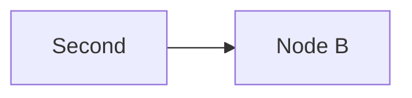

</td>
<td>

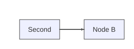

</td>
</tr>
</table>

<details>
<summary>View source code</summary>

```
flowchart LR
  A[First]
  A[Second]
  A --> B
  B[Node B]

```
</details>

---

## 10. Duplicate Subgraph

📄 **Source**: [`duplicate-subgraph.mmd`](./valid/duplicate-subgraph.mmd)

### Rendered Output

<table>
<tr>
<th width="50%">Mermaid (Official)</th>
<th width="50%">Maid (Experimental)</th>
</tr>
<tr>
<td>

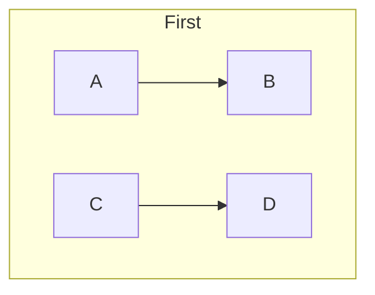

</td>
<td>

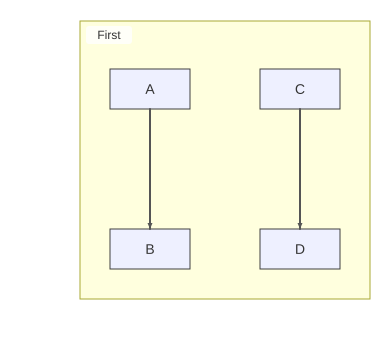

</td>
</tr>
</table>

<details>
<summary>View source code</summary>

```
flowchart TD
    subgraph same[First]
        A --> B
    end
    subgraph same[Second]
        C --> D
    end
```
</details>

---

## 11. Edge Attr Id Unknown

📄 **Source**: [`edge-attr-id-unknown.mmd`](./valid/edge-attr-id-unknown.mmd)

### Rendered Output

<table>
<tr>
<th width="50%">Mermaid (Official)</th>
<th width="50%">Maid (Experimental)</th>
</tr>
<tr>
<td>

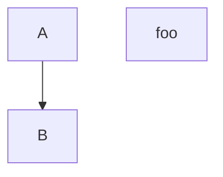

</td>
<td>

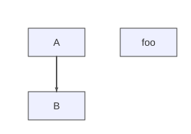

</td>
</tr>
</table>

<details>
<summary>View source code</summary>

```
flowchart TD
  A --> B
  foo@{ animate: true }


```
</details>

---

## 12. Edge Attrs Animate

📄 **Source**: [`edge-attrs-animate.mmd`](./valid/edge-attrs-animate.mmd)

### Rendered Output

<table>
<tr>
<th width="50%">Mermaid (Official)</th>
<th width="50%">Maid (Experimental)</th>
</tr>
<tr>
<td>

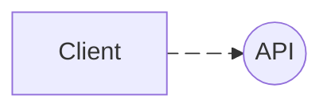

</td>
<td>

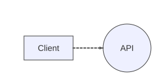

</td>
</tr>
</table>

<details>
<summary>View source code</summary>

```
flowchart LR
  A[Client] e2@-.-> B((API))
  e2@{ animate: true }


```
</details>

---

## 13. Edge Ids And Animation

📄 **Source**: [`edge-ids-and-animation.mmd`](./valid/edge-ids-and-animation.mmd)

### Rendered Output

<table>
<tr>
<th width="50%">Mermaid (Official)</th>
<th width="50%">Maid (Experimental)</th>
</tr>
<tr>
<td>

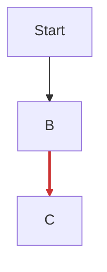

</td>
<td>

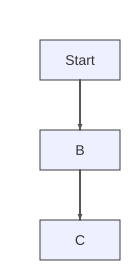

</td>
</tr>
</table>

<details>
<summary>View source code</summary>

```
flowchart TD
  A[Start] --> B
  B e1@--> C
  linkStyle 1 stroke:#cc3333,stroke-width:3

```
</details>

---

## 14. Edge Label Brackets Encoded Quotes

📄 **Source**: [`edge-label-brackets-encoded-quotes.mmd`](./valid/edge-label-brackets-encoded-quotes.mmd)

### Rendered Output

<table>
<tr>
<th width="50%">Mermaid (Official)</th>
<th width="50%">Maid (Experimental)</th>
</tr>
<tr>
<td>

```mermaid
graph TD
    B --|preGroupOperation&#91;&quot;aggregated_graph_analytics&quot;&#93; == true|--> C{Route to Graph Analytics}

```

</td>
<td>

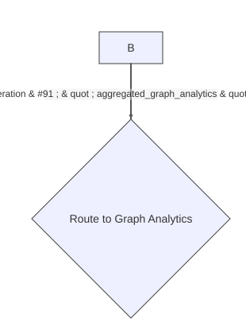

</td>
</tr>
</table>

<details>
<summary>View source code</summary>

```
graph TD
    B --|preGroupOperation&#91;&quot;aggregated_graph_analytics&quot;&#93; == true|--> C{Route to Graph Analytics}

```
</details>

---

## 15. Edge Label Quoted Pipe Br Backticks

📄 **Source**: [`edge-label-quoted-pipe-br-backticks.mmd`](./valid/edge-label-quoted-pipe-br-backticks.mmd)

### Rendered Output

<table>
<tr>
<th width="50%">Mermaid (Official)</th>
<th width="50%">Maid (Experimental)</th>
</tr>
<tr>
<td>

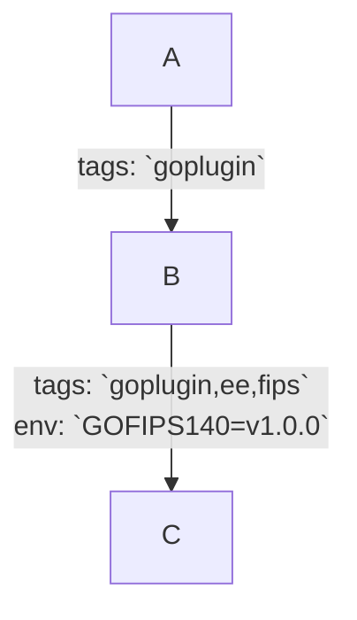

</td>
<td>

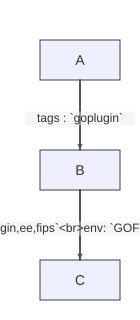

</td>
</tr>
</table>

<details>
<summary>View source code</summary>

```
graph TD
  A -->|tags: `goplugin`| B
  B -->|"tags: `goplugin,ee,fips`<br>env: `GOFIPS140=v1.0.0`"| C

```
</details>

---

## 16. Empty Diagram

📄 **Source**: [`empty-diagram.mmd`](./valid/empty-diagram.mmd)

### Rendered Output

<table>
<tr>
<th width="50%">Mermaid (Official)</th>
<th width="50%">Maid (Experimental)</th>
</tr>
<tr>
<td>

```mermaid
flowchart TD


```

</td>
<td>


</td>
</tr>
</table>

<details>
<summary>View source code</summary>

```
flowchart TD


```
</details>

---

## 17. Frontmatter Theme

📄 **Source**: [`frontmatter-theme.mmd`](./valid/frontmatter-theme.mmd)

### Rendered Output

<table>
<tr>
<th width="50%">Mermaid (Official)</th>
<th width="50%">Maid (Experimental)</th>
</tr>
<tr>
<td>

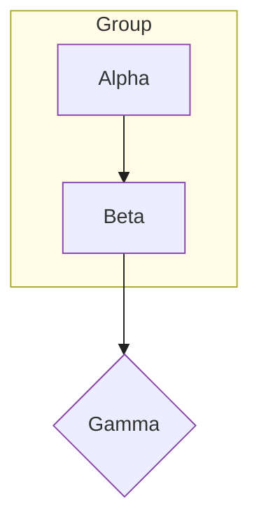

</td>
<td>

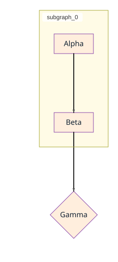

</td>
</tr>
</table>

<details>
<summary>View source code</summary>

```
---
config:
  themeVariables:
    nodeBkg: "#FFEEDD"
    nodeBorder: "#8844AA"
    nodeTextColor: "#112233"
    lineColor: "#222222"
    arrowheadColor: "#222222"
    clusterBkg: "#FFFBE6"
    clusterBorder: "#AAAA33"
    fontFamily: "Trebuchet MS"
    fontSize: "15px"
---
flowchart TD
  subgraph Group
    A[Alpha] --> B[Beta]
  end
  B --> C{Gamma}


```
</details>

---

## 18. Html In Labels

📄 **Source**: [`html-in-labels.mmd`](./valid/html-in-labels.mmd)

### Rendered Output

<table>
<tr>
<th width="50%">Mermaid (Official)</th>
<th width="50%">Maid (Experimental)</th>
</tr>
<tr>
<td>

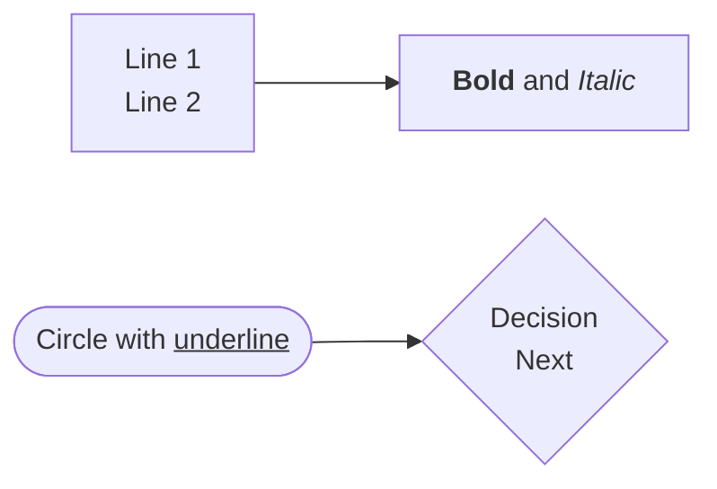

</td>
<td>

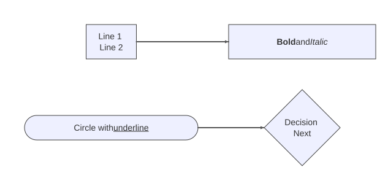

</td>
</tr>
</table>

<details>
<summary>View source code</summary>

```
flowchart LR
  A["Line 1<br/>Line 2"] --> B["<b>Bold</b> and <i>Italic</i>"]
  C(["Circle with <u>underline</u>"]) --> D{Decision<br/>Next}


```
</details>

---

## 19. Interactions Linkstyle Multi

📄 **Source**: [`interactions-linkstyle-multi.mmd`](./valid/interactions-linkstyle-multi.mmd)

### Rendered Output

<table>
<tr>
<th width="50%">Mermaid (Official)</th>
<th width="50%">Maid (Experimental)</th>
</tr>
<tr>
<td>

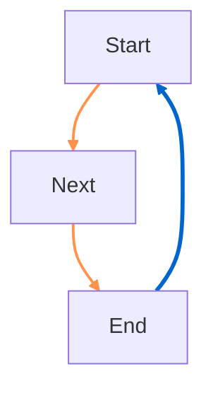

</td>
<td>

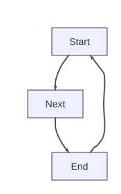

</td>
</tr>
</table>

<details>
<summary>View source code</summary>

```
flowchart TD
  A[Start] --> B[Next]
  B --> C[End]
  C --> A
  %% multiple linkStyle lines; whitespace variations but single-line style pairs (CLI baseline)
  linkStyle 0,1 stroke:#f60,stroke-width:2px,opacity:0.7
  linkStyle 2    stroke:#06c,  stroke-width:3px

```
</details>

---

## 20. Keywords In Labels

📄 **Source**: [`keywords-in-labels.mmd`](./valid/keywords-in-labels.mmd)

### Rendered Output

<table>
<tr>
<th width="50%">Mermaid (Official)</th>
<th width="50%">Maid (Experimental)</th>
</tr>
<tr>
<td>

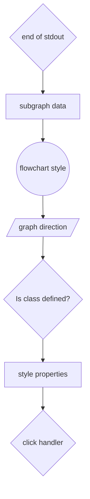

</td>
<td>

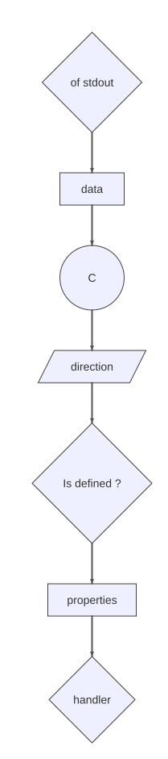

</td>
</tr>
</table>

<details>
<summary>View source code</summary>

```
flowchart TD
    A{end of stdout}
    B[subgraph data]
    C((flowchart style))
    D[/graph direction/]
    E{Is class defined?}
    F[style properties]
    G{click handler}

    A --> B
    B --> C
    C --> D
    D --> E
    E --> F
    F --> G

```
</details>

---

## 21. Link Styles

📄 **Source**: [`link-styles.mmd`](./valid/link-styles.mmd)

### Rendered Output

<table>
<tr>
<th width="50%">Mermaid (Official)</th>
<th width="50%">Maid (Experimental)</th>
</tr>
<tr>
<td>

```mermaid
flowchart LR
    A --> B
    A -.-> C
    A ==> D
    A -.text.-> E
    A ==text==> F
    A -- text --> G
    A -->|text| H
```

</td>
<td>

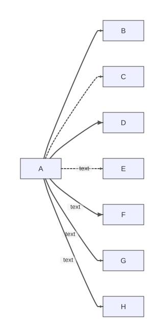

</td>
</tr>
</table>

<details>
<summary>View source code</summary>

```
flowchart LR
    A --> B
    A -.-> C
    A ==> D
    A -.text.-> E
    A ==text==> F
    A -- text --> G
    A -->|text| H
```
</details>

---

## 22. Long Text

📄 **Source**: [`long-text.mmd`](./valid/long-text.mmd)

### Rendered Output

<table>
<tr>
<th width="50%">Mermaid (Official)</th>
<th width="50%">Maid (Experimental)</th>
</tr>
<tr>
<td>

```mermaid
flowchart TD
    A[This is a very long text that spans quite a bit of space in the node] --> B[Another long piece of text here]
```

</td>
<td>

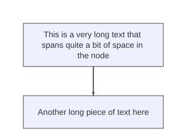

</td>
</tr>
</table>

<details>
<summary>View source code</summary>

```
flowchart TD
    A[This is a very long text that spans quite a bit of space in the node] --> B[Another long piece of text here]
```
</details>

---

## 23. Mismatched Quotes

📄 **Source**: [`mismatched-quotes.mmd`](./valid/mismatched-quotes.mmd)

### Rendered Output

<table>
<tr>
<th width="50%">Mermaid (Official)</th>
<th width="50%">Maid (Experimental)</th>
</tr>
<tr>
<td>

```mermaid
flowchart TD
  A["Mismatched label'] --> B
  C['Another mismatch"] --> D


```

</td>
<td>

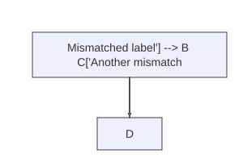

</td>
</tr>
</table>

<details>
<summary>View source code</summary>

```
flowchart TD
  A["Mismatched label'] --> B
  C['Another mismatch"] --> D


```
</details>

---

## 24. Multidirectional Arrows

📄 **Source**: [`multidirectional-arrows.mmd`](./valid/multidirectional-arrows.mmd)

### Rendered Output

<table>
<tr>
<th width="50%">Mermaid (Official)</th>
<th width="50%">Maid (Experimental)</th>
</tr>
<tr>
<td>

```mermaid
flowchart LR
    A <--> B
    C o--o D
    E x--x F
```

</td>
<td>

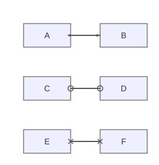

</td>
</tr>
</table>

<details>
<summary>View source code</summary>

```
flowchart LR
    A <--> B
    C o--o D
    E x--x F
```
</details>

---

## 25. Nested Subgraphs Lr

📄 **Source**: [`nested-subgraphs-lr.mmd`](./valid/nested-subgraphs-lr.mmd)

### Rendered Output

<table>
<tr>
<th width="50%">Mermaid (Official)</th>
<th width="50%">Maid (Experimental)</th>
</tr>
<tr>
<td>

```mermaid
flowchart LR
    subgraph outer[Outer]
        subgraph inner[Inner]
            A --> B
        end
        C --> D
    end
    outer --> E


```

</td>
<td>

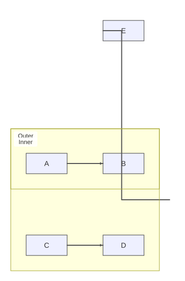

</td>
</tr>
</table>

<details>
<summary>View source code</summary>

```
flowchart LR
    subgraph outer[Outer]
        subgraph inner[Inner]
            A --> B
        end
        C --> D
    end
    outer --> E


```
</details>

---

## 26. Nested Subgraphs

📄 **Source**: [`nested-subgraphs.mmd`](./valid/nested-subgraphs.mmd)

### Rendered Output

<table>
<tr>
<th width="50%">Mermaid (Official)</th>
<th width="50%">Maid (Experimental)</th>
</tr>
<tr>
<td>

```mermaid
flowchart TD
    subgraph outer[Outer]
        subgraph inner[Inner]
            A --> B
        end
        C --> D
    end
    outer --> E
```

</td>
<td>

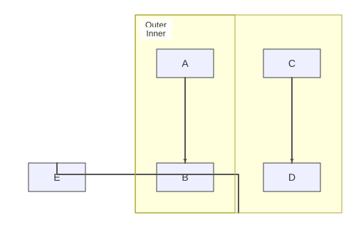

</td>
</tr>
</table>

<details>
<summary>View source code</summary>

```
flowchart TD
    subgraph outer[Outer]
        subgraph inner[Inner]
            A --> B
        end
        C --> D
    end
    outer --> E
```
</details>

---

## 27. Node Ids Special

📄 **Source**: [`node-ids-special.mmd`](./valid/node-ids-special.mmd)

### Rendered Output

<table>
<tr>
<th width="50%">Mermaid (Official)</th>
<th width="50%">Maid (Experimental)</th>
</tr>
<tr>
<td>

```mermaid
flowchart TD
    id1[Node 1]
    id-2[Node 2]
    id_3[Node 3]
    ID4[Node 4]
    _id5[Node 5]
    id1 --> id-2
    id-2 --> id_3
    id_3 --> ID4
    ID4 --> _id5
```

</td>
<td>

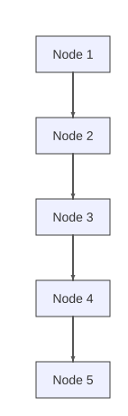

</td>
</tr>
</table>

<details>
<summary>View source code</summary>

```
flowchart TD
    id1[Node 1]
    id-2[Node 2]
    id_3[Node 3]
    ID4[Node 4]
    _id5[Node 5]
    id1 --> id-2
    id-2 --> id_3
    id_3 --> ID4
    ID4 --> _id5
```
</details>

---

## 28. Node To Subgraph

📄 **Source**: [`node-to-subgraph.mmd`](./valid/node-to-subgraph.mmd)

### Rendered Output

<table>
<tr>
<th width="50%">Mermaid (Official)</th>
<th width="50%">Maid (Experimental)</th>
</tr>
<tr>
<td>

```mermaid
flowchart TD
  subgraph inner[Inner]
    A --> B
  end
  C --> inner


```

</td>
<td>

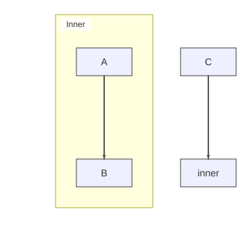

</td>
</tr>
</table>

<details>
<summary>View source code</summary>

```
flowchart TD
  subgraph inner[Inner]
    A --> B
  end
  C --> inner


```
</details>

---

## 29. Only Nodes

📄 **Source**: [`only-nodes.mmd`](./valid/only-nodes.mmd)

### Rendered Output

<table>
<tr>
<th width="50%">Mermaid (Official)</th>
<th width="50%">Maid (Experimental)</th>
</tr>
<tr>
<td>

```mermaid
flowchart TD
    A[Node A]
    B[Node B]
    C[Node C]
```

</td>
<td>

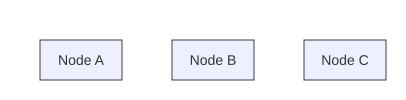

</td>
</tr>
</table>

<details>
<summary>View source code</summary>

```
flowchart TD
    A[Node A]
    B[Node B]
    C[Node C]
```
</details>

---

## 30. Quotes Single Inside Double

📄 **Source**: [`quotes-single-inside-double.mmd`](./valid/quotes-single-inside-double.mmd)

### Rendered Output

<table>
<tr>
<th width="50%">Mermaid (Official)</th>
<th width="50%">Maid (Experimental)</th>
</tr>
<tr>
<td>

```mermaid
flowchart LR
  A["He said 'Hi'"] --> B


```

</td>
<td>

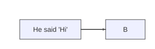

</td>
</tr>
</table>

<details>
<summary>View source code</summary>

```
flowchart LR
  A["He said 'Hi'"] --> B


```
</details>

---

## 31. Simple Flow

📄 **Source**: [`simple-flow.mmd`](./valid/simple-flow.mmd)

### Rendered Output

<table>
<tr>
<th width="50%">Mermaid (Official)</th>
<th width="50%">Maid (Experimental)</th>
</tr>
<tr>
<td>

```mermaid
flowchart TD
    Start --> Stop
```

</td>
<td>

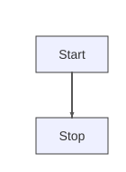

</td>
</tr>
</table>

<details>
<summary>View source code</summary>

```
flowchart TD
    Start --> Stop
```
</details>

---

## 32. Special Arrows

📄 **Source**: [`special-arrows.mmd`](./valid/special-arrows.mmd)

### Rendered Output

<table>
<tr>
<th width="50%">Mermaid (Official)</th>
<th width="50%">Maid (Experimental)</th>
</tr>
<tr>
<td>

```mermaid
flowchart LR
    A o--o B
    B x--x C
    C <--> D
    D -.-> E
```

</td>
<td>

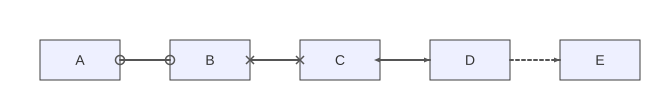

</td>
</tr>
</table>

<details>
<summary>View source code</summary>

```
flowchart LR
    A o--o B
    B x--x C
    C <--> D
    D -.-> E
```
</details>

---

## 33. Special Chars

📄 **Source**: [`special-chars.mmd`](./valid/special-chars.mmd)

### Rendered Output

<table>
<tr>
<th width="50%">Mermaid (Official)</th>
<th width="50%">Maid (Experimental)</th>
</tr>
<tr>
<td>

```mermaid
flowchart LR
    A["Node with &quot;quotes&quot; and &amp; ampersand"] --> B["OK"]
    B --> C[Plain text]

```

</td>
<td>


</td>
</tr>
</table>

<details>
<summary>View source code</summary>

```
flowchart LR
    A["Node with &quot;quotes&quot; and &amp; ampersand"] --> B["OK"]
    B --> C[Plain text]

```
</details>

---

## 34. Styling Classes

📄 **Source**: [`styling-classes.mmd`](./valid/styling-classes.mmd)

### Rendered Output

<table>
<tr>
<th width="50%">Mermaid (Official)</th>
<th width="50%">Maid (Experimental)</th>
</tr>
<tr>
<td>

```mermaid
flowchart TD
    A:::classA --> B:::classB
    classDef classA fill:#f9f
    classDef classB stroke:#333,stroke-width:4px
```

</td>
<td>


</td>
</tr>
</table>

<details>
<summary>View source code</summary>

```
flowchart TD
    A:::classA --> B:::classB
    classDef classA fill:#f9f
    classDef classB stroke:#333,stroke-width:4px
```
</details>

---

## 35. Subgraph Nested Direction

📄 **Source**: [`subgraph-nested-direction.mmd`](./valid/subgraph-nested-direction.mmd)

### Rendered Output

<table>
<tr>
<th width="50%">Mermaid (Official)</th>
<th width="50%">Maid (Experimental)</th>
</tr>
<tr>
<td>

```mermaid
flowchart TD
  subgraph Outer[Outer Title]
    direction LR
    A[Start] --> B[Next]
    subgraph Inner [Inner Title]
      direction TB
      C --> D
    end
    B --> C
  end

```

</td>
<td>


</td>
</tr>
</table>

<details>
<summary>View source code</summary>

```
flowchart TD
  subgraph Outer[Outer Title]
    direction LR
    A[Start] --> B[Next]
    subgraph Inner [Inner Title]
      direction TB
      C --> D
    end
    B --> C
  end

```
</details>

---

## 36. Subgraph Quoted Title

📄 **Source**: [`subgraph-quoted-title.mmd`](./valid/subgraph-quoted-title.mmd)

### Rendered Output

<table>
<tr>
<th width="50%">Mermaid (Official)</th>
<th width="50%">Maid (Experimental)</th>
</tr>
<tr>
<td>

```mermaid
flowchart TD
  subgraph "Runtime Execution"
    A[Start] --> B{Decision}
  end
  B --> C[Done]


```

</td>
<td>


</td>
</tr>
</table>

<details>
<summary>View source code</summary>

```
flowchart TD
  subgraph "Runtime Execution"
    A[Start] --> B{Decision}
  end
  B --> C[Done]


```
</details>

---

## 37. Subgraph To Node

📄 **Source**: [`subgraph-to-node.mmd`](./valid/subgraph-to-node.mmd)

### Rendered Output

<table>
<tr>
<th width="50%">Mermaid (Official)</th>
<th width="50%">Maid (Experimental)</th>
</tr>
<tr>
<td>

```mermaid
flowchart TD
  subgraph outer[Outer]
    A --> B
  end
  outer --> C


```

</td>
<td>


</td>
</tr>
</table>

<details>
<summary>View source code</summary>

```
flowchart TD
  subgraph outer[Outer]
    A --> B
  end
  outer --> C


```
</details>

---

## 38. Subgraph To Subgraph Lr

📄 **Source**: [`subgraph-to-subgraph-lr.mmd`](./valid/subgraph-to-subgraph-lr.mmd)

### Rendered Output

<table>
<tr>
<th width="50%">Mermaid (Official)</th>
<th width="50%">Maid (Experimental)</th>
</tr>
<tr>
<td>

```mermaid
flowchart LR
  subgraph A1[Group A]
    A --> B
  end
  subgraph B1[Group B]
    C --> D
  end
  A1 --> B1


```

</td>
<td>


</td>
</tr>
</table>

<details>
<summary>View source code</summary>

```
flowchart LR
  subgraph A1[Group A]
    A --> B
  end
  subgraph B1[Group B]
    C --> D
  end
  A1 --> B1


```
</details>

---

## 39. Subgraph To Subgraph

📄 **Source**: [`subgraph-to-subgraph.mmd`](./valid/subgraph-to-subgraph.mmd)

### Rendered Output

<table>
<tr>
<th width="50%">Mermaid (Official)</th>
<th width="50%">Maid (Experimental)</th>
</tr>
<tr>
<td>

```mermaid
flowchart TD
  subgraph A1[Group A]
    A --> B
  end
  subgraph B1[Group B]
    C --> D
  end
  A1 --> B1


```

</td>
<td>


</td>
</tr>
</table>

<details>
<summary>View source code</summary>

```
flowchart TD
  subgraph A1[Group A]
    A --> B
  end
  subgraph B1[Group B]
    C --> D
  end
  A1 --> B1


```
</details>

---

## 40. Subgraphs

📄 **Source**: [`subgraphs.mmd`](./valid/subgraphs.mmd)

### Rendered Output

<table>
<tr>
<th width="50%">Mermaid (Official)</th>
<th width="50%">Maid (Experimental)</th>
</tr>
<tr>
<td>

```mermaid
flowchart TD
    subgraph one[One]
        A --> B
    end
    subgraph two[Two]
        C --> D
    end
    one --> two
```

</td>
<td>


</td>
</tr>
</table>

<details>
<summary>View source code</summary>

```
flowchart TD
    subgraph one[One]
        A --> B
    end
    subgraph two[Two]
        C --> D
    end
    one --> two
```
</details>

---

## 41. Typed Shapes Bad Units

📄 **Source**: [`typed-shapes-bad-units.mmd`](./valid/typed-shapes-bad-units.mmd)

### Rendered Output

<table>
<tr>
<th width="50%">Mermaid (Official)</th>
<th width="50%">Maid (Experimental)</th>
</tr>
<tr>
<td>

```mermaid
flowchart TD
  A@{ shape: rect, padding: "12pt", label: "A" }
  B@{ shape: rect, cornerRadius: "2em", label: "B" }
  C@{ shape: rect, label: C }


```

</td>
<td>


</td>
</tr>
</table>

<details>
<summary>View source code</summary>

```
flowchart TD
  A@{ shape: rect, padding: "12pt", label: "A" }
  B@{ shape: rect, cornerRadius: "2em", label: "B" }
  C@{ shape: rect, label: C }


```
</details>

---

## 42. Typed Shapes Basic

📄 **Source**: [`typed-shapes-basic.mmd`](./valid/typed-shapes-basic.mmd)

### Rendered Output

<table>
<tr>
<th width="50%">Mermaid (Official)</th>
<th width="50%">Maid (Experimental)</th>
</tr>
<tr>
<td>

```mermaid
flowchart LR
  A@{ shape: rect, label: "Start" } --> B@{ shape: lean-r, label: "Next" }
  C@{ shape: diamond, label: "Decision" } -->|Yes| D@{ shape: rect, label: "Do" }
  C@{ shape: diamond, label: "Decision" } -->|No| E@{ shape: rect, label: "Skip" }


```

</td>
<td>


</td>
</tr>
</table>

<details>
<summary>View source code</summary>

```
flowchart LR
  A@{ shape: rect, label: "Start" } --> B@{ shape: lean-r, label: "Next" }
  C@{ shape: diamond, label: "Decision" } -->|Yes| D@{ shape: rect, label: "Do" }
  C@{ shape: diamond, label: "Decision" } -->|No| E@{ shape: rect, label: "Skip" }


```
</details>

---

## 43. Undefined Node

📄 **Source**: [`undefined-node.mmd`](./valid/undefined-node.mmd)

### Rendered Output

<table>
<tr>
<th width="50%">Mermaid (Official)</th>
<th width="50%">Maid (Experimental)</th>
</tr>
<tr>
<td>

```mermaid
flowchart TD
    A --> B
    B --> C
    D --> E
```

</td>
<td>


</td>
</tr>
</table>

<details>
<summary>View source code</summary>

```
flowchart TD
    A --> B
    B --> C
    D --> E
```
</details>

---

## 44. Unicode Text

📄 **Source**: [`unicode-text.mmd`](./valid/unicode-text.mmd)

### Rendered Output

<table>
<tr>
<th width="50%">Mermaid (Official)</th>
<th width="50%">Maid (Experimental)</th>
</tr>
<tr>
<td>

```mermaid
flowchart LR
    A[Hello 世界]
    B[Emoji 😀]
    C[Symbols ★☆♦♠]
    A --> B
    B --> C
```

</td>
<td>


</td>
</tr>
</table>

<details>
<summary>View source code</summary>

```
flowchart LR
    A[Hello 世界]
    B[Emoji 😀]
    C[Symbols ★☆♦♠]
    A --> B
    B --> C
```
</details>

---

## 45. With Text

📄 **Source**: [`with-text.mmd`](./valid/with-text.mmd)

### Rendered Output

<table>
<tr>
<th width="50%">Mermaid (Official)</th>
<th width="50%">Maid (Experimental)</th>
</tr>
<tr>
<td>

```mermaid
flowchart LR
    A[Start Process] --> B{Decision}
    B -->|Yes| C[Do something]
    B -->|No| D[Do something else]
    C --> E[End]
    D --> E
```

</td>
<td>


</td>
</tr>
</table>

<details>
<summary>View source code</summary>

```
flowchart LR
    A[Start Process] --> B{Decision}
    B -->|Yes| C[Do something]
    B -->|No| D[Do something else]
    C --> E[End]
    D --> E
```
</details>

---

